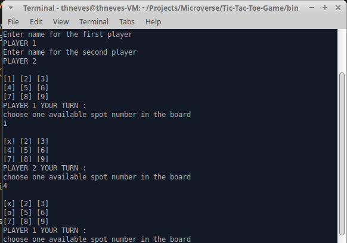

# Tic Tac Toe

This project consists in creating the Tic Tac Toe game to be played in the computer terminal.

## About Tic Tac Toe game:

- In order to win the game, a player must place three of their marks in a horizontal, vertical, or diagonal row.
- Each player takes one turn to choose an available spot in the board.
- If all the spots are marked and no one makes a winning sequence, the game ends in a draw.

## Getting Started

To get a local copy up and running follow these steps.

### Prerequisites:
- You need to have [Ruby](https://www.ruby-lang.org/en/) installed in your local machine: 

### Setup & install
- You can clone or download the project folder by using the green button above. We assume that you know how to use git and the terminal to clone the repository, otherwise just download the folder. 

### Usage:
- Open you terminal:  
  - For MS-windows, press the Windows Key + R, write cmd on the box and press enter. 
  - For linux press Ctrl + Alt + T. 
  - If you are on Mac, first click Go > Utilities from the menu bar. In the Utilities folder that opens, double-click Terminal. 
- Make sure you are on the right drive where you downloaded or cloned the project folder. To do this just write cmd + "the name of your drive " + ":" and press enter. For example,  cmd d: and press enter. 
- Navigate to the project folder on the terminal. To do this write cmd + "project folder location" and press enter. For example on windows, cmd d:\users\john\Tic-Tac-Toe-Game and press enter. On linux you have to be carefull about writing '/' instead of '\'.
- Write "bin\main" on the terminal an press enter. Again, on linux make sure you are using '/' instead of '\'.
- Enjoy. 

## If you don't want to setup the game locally, you can play the game on Repl.it:

- [RUN on Repl.it](https://repl.it/@ThalesNeves/Tic-Tac-Toe-Game#bin/main) 
- Write  "bin/main" on the repl.it terminal
- Enjoy. 
## Built With

- RUBY
- VS Code

## Author

👤 **Jorge Hernandez**

- Github: [@Jhdezj](https://github.com/Jhdezj)

👤 **Thales Neves**

- GitHub: [@thneves](https://github.com/thneves)
- LinkedIn: [@thales-neves10](https://www.linkedin.com/in/thales-neves10/)
- Twitter: [@tsneves11](https://twitter.com/tsneves11)

## Contributing

Contributions, issues, and feature requests are welcome!

Feel free to check the [issues page](https://github.com/thneves/Tic-Tac-Toe-Game/issues).

## Support this project

Give a :star: if you like this project!
